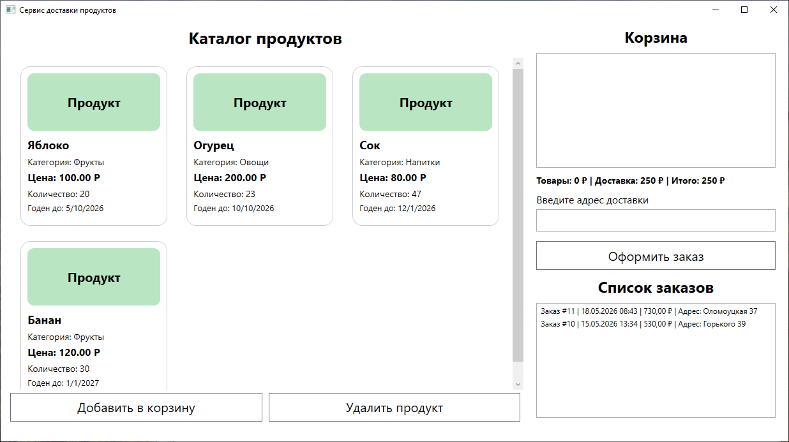
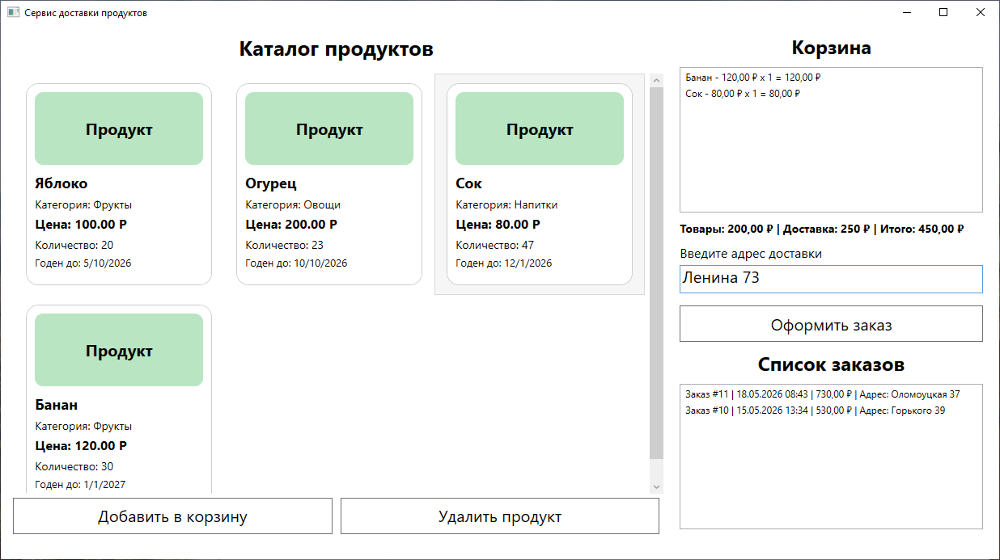
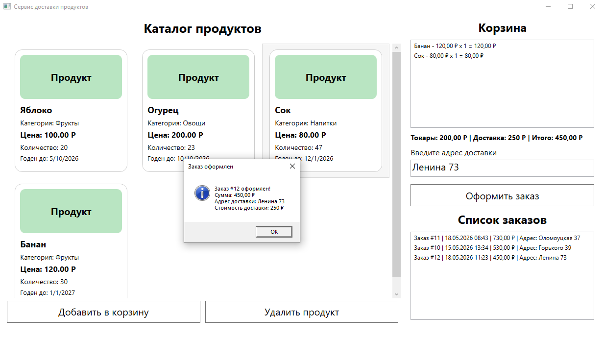
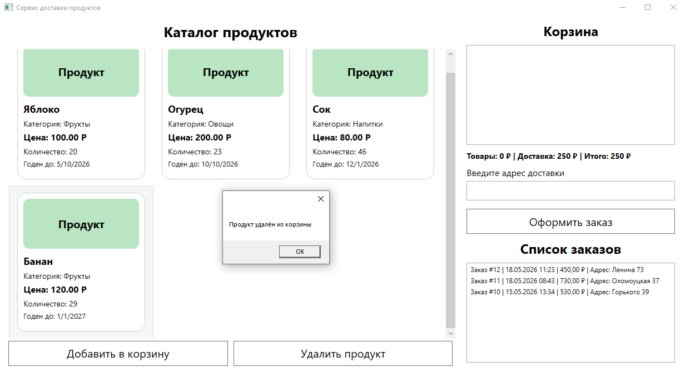
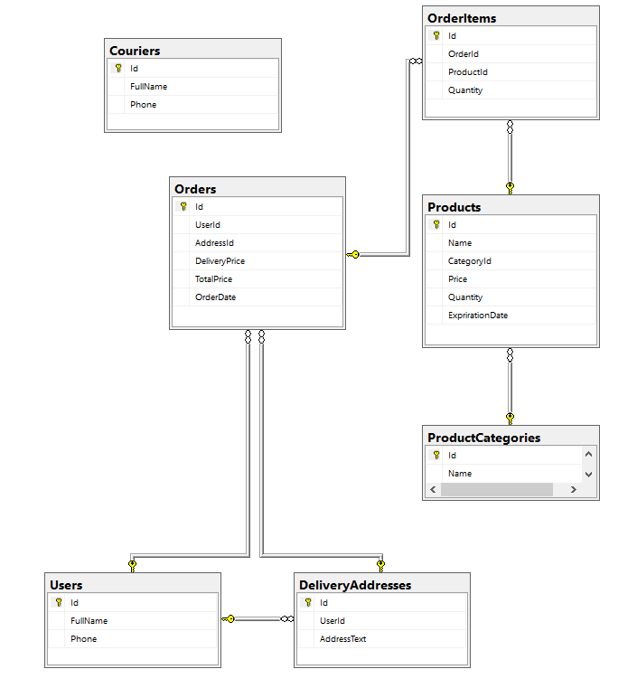

# Сервис доставки продуктов

## 1. Описание проекта
Данный проект представляет собой WPF-приложение для оформления заказов продуктов с доставкой. 
Система позволяет просматривать каталог товаров, добавлять продукты в корзину и оформлять доставку.

Тип работы: учебный проект

---

## 2. Цель и задачи проекта
**Цель:** разработка приложения для сервиса доставки продуктов.

**Задачи:**
- разработка базы данных
- создание интерфейса WPF
- реализация корзины и заказов
- расчёт стоимости заказа
- тестирование бизнес-логики

**Область применения:** сервис доставки продуктов

---

## 3. Функциональность
- просмотр каталога продуктов
- добавление товаров в корзину
- удаление продуктов
- оформление заказа
- выбор адреса доставки
- отображение списка заказов
- расчёт общей стоимости заказа
- проверка срока годности продуктов

---

## 4. Архитектура проекта
Тип архитектуры: клиент-сервер

**Технологии:**
- C#
- WPF
- .NET
- SQL Server Management Studio
- MSTest

**Структура проекта:**
- `GroceryDeliveryApp/` — основной WPF-проект и интерфейс приложения
- `GroceryDeliveryApp.Core/` — бизнес-логика и модели данных
- `GroceryDeliveryApp.Tests/` — unit-тесты

---

## 5. Установка и запуск

**Требования:**
- Windows 10/11
- .NET Framework

**Установка:**
```bash
git clone https://github.com/Danilkaaa332/GroceryDeliveryApp.git
```

**Запуск:**
- перейти в папку bin/Release
- Запустить файл GroceryDeliveryApp.exe

---

## 6. Использование
После запуска системы пользователь может:
- просматривать каталог продуктов
- добавлять товары в корзину
- оформлять доставку
- просматривать список заказов

---

## 7. Демонстрация
### Главное окно


### Добавление продукта в корзину


### Оформление заказа


### Удаление продукта из корзины


### База данных


---

## 8. Тестирование
Для проекта реализованы unit-тесты:
- тест расчёта корзины
- тест расчёта доставки
- тест проверки срока годности
- тест формирования заказа

---

## 9. Результаты и выводы
В ходе выполнения проекта было разработано приложение для доставки продуктов.

Практическая значимость:
- автоматизация оформления заказов
- удобное управление корзиной

---

## 10. Автор
Студент: Зеленин Данил Андреевич
Группа: ИСП-9  
Специальность: Информационные системы и программирование  

Руководитель: Дмитриев А.А.

Контакты:
- email: danilkaaa323@gmail.com
- GitHub: https://github.com/Danilkaaa332

---

## 11. Лицензия
Проект разработан в учебных целях.
